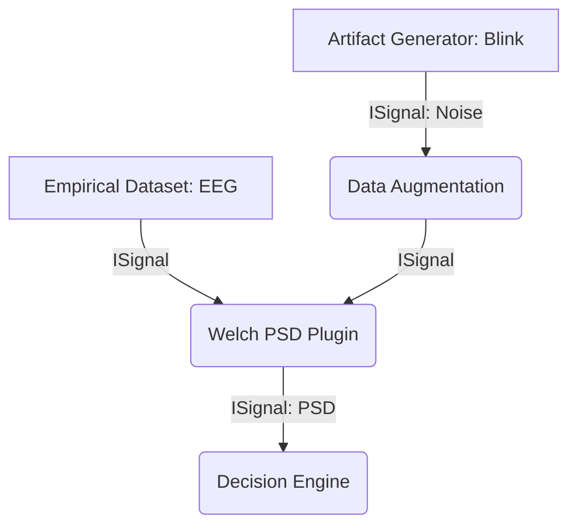

# Data Flow

The VIREON ecosystem fundamentally separates the data payloads from the computational pipelines. Data flows through a Directed Acyclic Graph (DAG) constructed dynamically based on capabilities.

## The `IScientificObject`
Data is never passed between nodes as raw primitives (like `numpy.ndarray` or `pd.DataFrame`). Every payload must be wrapped in an `IScientificObject`.

For instance, an `ISignal` encapsulates:
- The `data` (a numeric array)
- The `sampling_rate`
- The `montage` (spatial configuration)
- The `modality` (e.g. `EEG`, `MEG`, `LFP`)

## Flow Execution
1. **Input Generation**: Source models (like a `DipoleGenerator`) or empirical datasets generate an initial `IScientificObject`.
2. **Capability Matching**: The kernel searches for a plugin that *consumes* the generated output type.
3. **Execution**: The `execute` method is invoked. The plugin consumes the inputs, performs its internal logic, and returns a new `IScientificObject`.
4. **Validation**: The kernel validates that the output matches the explicitly defined `produces` capability.

## Phase E Implementation Status
> [!NOTE]
> As of Phase E, the architecture has expanded to include Massive Campaigns, Hardware Digital Twins, EvidenceBundle v5 (SRI/Regulatory mapping), and the Reproduce CLI. Features described in this document may be subject to these new workflows. If specific API endpoints, models, or UI components are discussed but missing in the codebase, they are currently [STUBBED] pending Phase F implementation.
