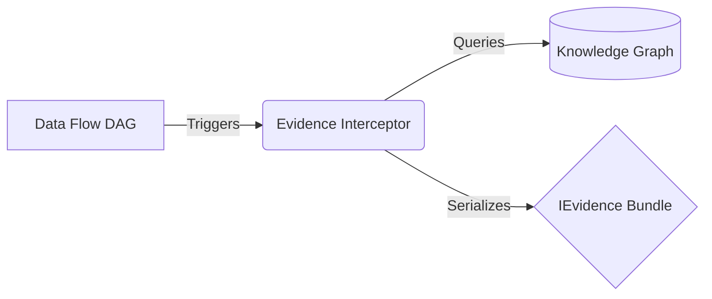

# Evidence Flow

Data flow produces mathematical results. Evidence flow produces *provenance*.

In traditional data science, when a script finishes, you have a result (e.g., "Accuracy: 85%"). In NVOS, a result without provenance is considered scientifically invalid. The **Evidence Engine** shadows the execution of the Data Flow DAG to record exactly how that result was achieved.

## Constructing the `IEvidence` Bundle
Every time a plugin calls `execute()`, the Evidence Engine records an event:
- **Git Hash**: What version of the code was running?
- **Plugin ID & Version**: Which specific methodology was used?
- **Scientific Contract**: What were the assumptions enforced at the time of execution?
- **Random Seeds**: What was the stochastic state of the system?
- **Knowledge Graph Links**: Which literature nodes are associated with this execution?

This immutable `IEvidence` bundle is the final output of any execution run. It can be cryptographically signed and used as the basis for a regulatory submission (e.g. FDA Q-Sub).